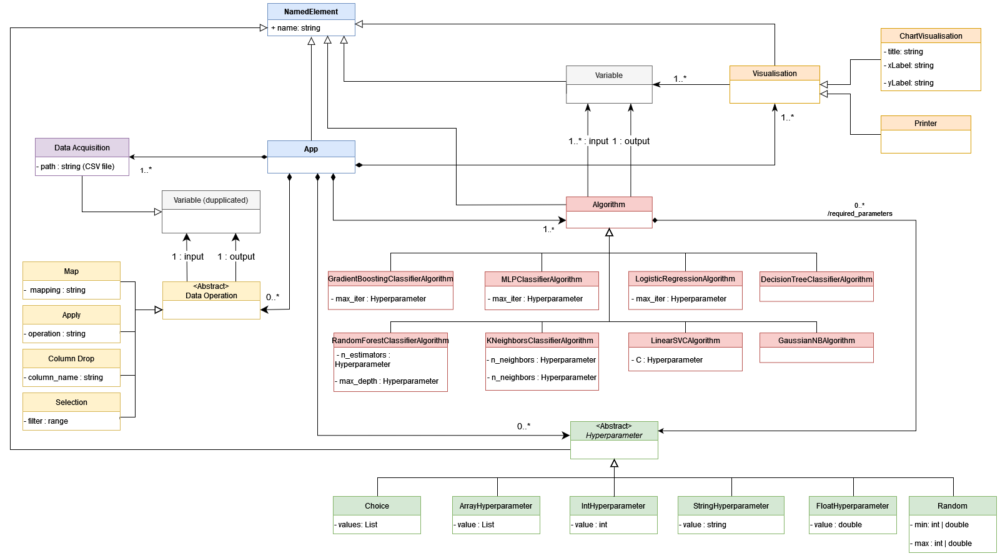

# DSL-Kisled-AI
DSL for Data Mining

## Authors
* Alexandre Arcil
* Gabriel Cogne
* Thomas Di Grande
* Dan Nakache

## Usage
```shell
# Compilation at root of the project
mvn package

# Run
java -jar target/KISLED-AI-1.0.jar [OPTIONS] path_to_DSL_script
```

| Options |  Arguments  |                   Description                    |      Possible values      |
|:-------:|:-----------:|:------------------------------------------------:|:-------------------------:|
|   -o    | output_file | Set the output file (extension must be defined). | absolute or relative path |
|   -e    |   format    |            Define the output format.             |        py or ipynb        |

## Domain Model


## Backus-Naur Form

```bnf
app ::= read_stmt stmts char_stmt ;

stmts ::= stmt stmts | /* No statements */ ;

stmt ::= read_stmt | op_stmt | algo_stmt | validation_stmt | disp_stmt ;

read_stmt ::= "read" "(" PATH optional_index_col ")" ">>" var ;

optional_index_col ::= "," STRING | /* Default index column */ ;

op_stmt ::= (select_op | apply_op) ">>" var | mapping_op ;

select_op ::= var "[" selectors "]" ;
selectors ::= selector "," selectors | selector ;
selector ::= INT | STRING | slice ;
slice ::= "r" "(" (INT "," INT "," INT | INT "," INT | INT | /* All elements slice */) ")" ;

apply_op ::= var ("+" value | "-" value | "-" STRING | "*" value | "/" value | "**" value | ".apply" "{" lambda "}") ;

mapping_op ::= var mapping_selector ">>" dict ">>" var mapping_selector ;

mapping_selector ::= "[" STRING "]" | /* No selector */ ;

algo_stmt ::=   ( "KNN" "(" "n_neighbors" ":" (value | random) "," "algorithm" ":" (STRING | choice | list) ")" 
                | "RandomForest" "(" "n_estimators" ":" (value | random) "," "max_depth" ":" (value | random) ")"
                | "LogisticRegression" "(" "max_iter" ":" (value | random) ")"
                | "GaussianNB" "(" ")"
                | "DecisionTreeClassifier" "(" ")"
                | "GradientBoostingClassifier" "(" "n_estimators" ":" (value | random) ")"
                | "LinearSVC" "(" "C" ":" (value | random) ")"
                | "MLPClassifier" "(" "max_iter" ":" (value | random) ")"
                ) ">>" var
                ;

random ::= "btw" "(" value "," value ")" ;
choice ::= "choice" "(" list ")" ;

validation_stmt ::= "validate" "(" var "," var "," var ")" ">>" var

disp_stmt ::= "disp" disp_names | "disp" "(" disp_names ")"

disp_names ::= NAME optional_selector ", " disp_names | NAME optional_selector ;
optional_selector ::= "." NAME "(" ")" | /* No selector */ ;

char_stmt ::= "chart" "(" STRING "," STRING "," STRING optional_params ")" | "chart" STRING "," STRING "," STRING optional_params ;
optional_params ::= "," "'" ("plot" | "bar" | "barh" | "scatter" | "hist") "'" optional_data_select | /* Default type */ ;

optional_data_select ::=    "," "data" ("[" (INT | STRING) "]" | "." NAME "(" ")")
                            | /* No data selection */ ;

lambda ::= names "->" expr
names ::= NAME ", " names | NAME
expr ::=      value 
            | BOOLEAN 
            | STRING
            | "++" var
            | var "++"
            | "--" var
            | var "--"
            | var
            | call
            | "-" var
            | "+" var
            | expr "+" expr
            | expr "-" expr
            | expr "*" expr
            | expr "/" expr
            | expr "%" expr
            | expr "<" expr
            | expr ">" expr
            | expr "==" expr
            | expr "!=" expr
            | expr "<=" expr
            | expr ">=" expr
            | expr "**" expr
            ;

var ::= NAME
call ::= var "(" eparam_list  ")"
eparam_list ::= expr ("," eparam_list | /* End of list */) | /* No parameters */

value ::= INT | FLOAT ;
list ::= "[" (list_elems | /* Empty list */) "]" ;
list_elems ::= (value | STRING) "," (list_elems | /* End of list */) ;
dict ::= "[" (dict_elems | ":") "]" ;
dict_elems ::= "'" NAME "'" ":" (value | STRING | dict | list) ("," dict_elems | /* End of dict */ ) ;
```